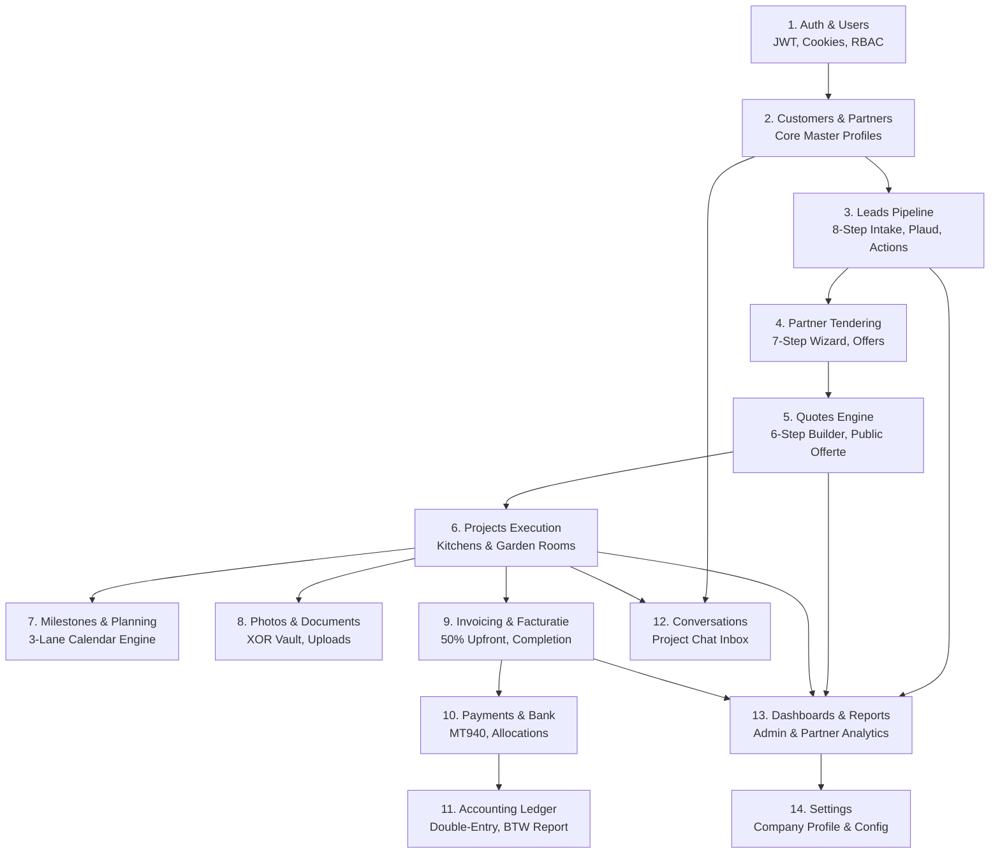

# API_IMPLEMENTATION_PLAN.md — Comprehensive Frontend → API → Database Gap Analysis

> **Status:** Approved Architecture Blueprint for Full Backend Development  
> **Scope:** Entire Frontend Client (`frontend/src`) ↔ Fastify Backend API (`backend/src`) ↔ PostgreSQL (`vanuit ambacht`)  
> **Target:** 100% Backend-Driven, Production-Ready Application (Zero Mock Data, Zero LocalStorage Dependencies)  
> **Rule:** No business API implementation until this plan is formally reviewed.

---

# 1. Executive Summary & Inventory Overview

This document provides an exhaustive inventory of every page, dashboard, tab, form, modal, table, card, button, and user interaction across the entire Vanuit Ambacht platform. It maps each user action to its required REST endpoint, HTTP verb, backend domain module, Drizzle/PostgreSQL table target, permission guard, storage requirement, and PDF/external service integration.

---

# 2. Detailed Frontend Action & Gap Analysis Matrix

The table below catalogs every frontend capability across the platform:

| # | Page / View | Menu / Submenu / Tab | UI Element / Action | Current Data Source | Current LocalStorage Key | Required API Endpoint | Method | Backend Module | Database Table(s) | Role & Permissions | File / PDF / External Service | Priority | Status |
|---|---|---|---|---|---|---|---|---|---|---|---|---|---|
| **1.0 AUTHENTICATION & SESSION** |
| 1.1 | `Login.jsx` | Public Login | Submit Email + Password | Hardcoded `DEMO_USERS` + `app_system_users` | `sessionStorage('auth_user')` | `POST /api/auth/login` | POST | `auth` | `users`, `partners`, `customers` | Public | None | P0 | **IMPLEMENTED** |
| 1.2 | `Login.jsx` | Public Login | Request Password Reset | State only | None | `POST /api/auth/forgot-password` | POST | `auth` | `users` | Public | Email Service (SMTP/Postmark) | P2 | BACKEND PLANNED |
| 1.3 | `MainLayout.jsx` / `TopNav.jsx` | Header | Logout Button | Session clear | `sessionStorage('auth_user')` | `POST /api/auth/logout` | POST | `auth` | None (Clears HttpOnly Cookie) | Authenticated | None | P0 | **IMPLEMENTED** |
| 1.4 | `useAuth.jsx` | Global Context | App Boot / Session Rehydrate | `sessionStorage` | `sessionStorage('auth_user')` | `GET /api/auth/me` | GET | `auth` | `users`, `partners`, `customers` | Authenticated | None | P0 | **IMPLEMENTED** |
| 1.5 | `Profile.jsx` | Profile Page | View Current Profile | Hardcoded state | None | `GET /api/users/profile` | GET | `users` | `users` | Authenticated | None | P1 | BACKEND PLANNED |
| 1.6 | `Profile.jsx` | Profile Page | Update Contact / Password | State only | None | `PATCH /api/users/profile` | PATCH | `users` | `users` | Authenticated | None | P1 | BACKEND PLANNED |
| **2.0 ADMIN DASHBOARD** |
| 2.1 | `AdminDashboard.jsx` | Overview | KPI Cards (Leads, Quotes, Projects, Revenue) | `mockFinancials`, `mockLeads`, `mockQuotes` | `app_leads_v2`, `app_quotes_v2` | `GET /api/dashboard/admin/stats` | GET | `dashboard` | `leads`, `quotes`, `projects`, `invoices` | `admin` | Aggregation Engine | P1 | BACKEND PLANNED |
| 2.2 | `AdminDashboard.jsx` | Overview | Date Range Filter (7d, 30d, month, custom) | State filter | None | `GET /api/dashboard/admin/stats?range=...` | GET | `dashboard` | `leads`, `projects`, `invoices` | `admin` | Aggregation Engine | P1 | BACKEND PLANNED |
| 2.3 | `AdminDashboard.jsx` | Overview | Recent Activities Timeline | `mockRecentActivities` | None | `GET /api/dashboard/admin/activities` | GET | `dashboard` | `leads`, `projects`, `quote_versions`, `invoices` | `admin` | Audit Feed | P2 | BACKEND PLANNED |
| 2.4 | `AdminDashboard.jsx` | Overview | Follow-up Reminders & Alerts | `mockFollowUps`, `mockWarnings` | None | `GET /api/dashboard/admin/alerts` | GET | `dashboard` | `tasks`, `leads`, `projects` | `admin` | Alert Engine | P1 | BACKEND PLANNED |
| 2.5 | `AdminDashboard.jsx` | Overview | Quick Action: "Nieuwe Lead" Modal | Form submit | `app_leads_v2` | `POST /api/leads` | POST | `leads` | `leads` | `admin` | None | P1 | BACKEND PLANNED |
| 2.6 | `AdminDashboard.jsx` | Overview | Quick Action: "Direct Offerte Maken" Modal | Form submit | `app_quotes_v2` | `POST /api/quotes` | POST | `quotes` | `quotes`, `quote_versions` | `admin` | None | P1 | BACKEND PLANNED |
| 2.7 | `AdminDashboard.jsx` | Overview | Quick Action: "Factuur Aanmaken" Modal | Form submit | `app_invoices` | `POST /api/invoices` | POST | `invoices` | `invoices`, `invoice_items` | `admin` | None | P1 | BACKEND PLANNED |
| **3.0 LEADS & SALES PIPELINE (8-STEP ENGINE)** |
| 3.1 | `Leads.jsx` | Leads List | Load Leads Table | `mockLeads` | `app_leads_v2` | `GET /api/leads` | GET | `leads` | `leads` | `admin` | Search / Filter / Pagination | P1 | BACKEND PLANNED |
| 3.2 | `Leads.jsx` | Leads List | Filter by Status / Product / Assigned | In-memory filter | None | `GET /api/leads?status=...&product=...` | GET | `leads` | `leads` | `admin` | Server Filtering | P1 | BACKEND PLANNED |
| 3.3 | `Leads.jsx` | Add Modal | Create New Lead Form | Form submit | `app_leads_v2` | `POST /api/leads` | POST | `leads` | `leads` | `admin` | None | P1 | BACKEND PLANNED |
| 3.4 | `Leads.jsx` | Edit Modal | Edit Lead Information | Form submit | `app_leads_v2` | `PATCH /api/leads/:id` | PATCH | `leads` | `leads` | `admin` | None | P1 | BACKEND PLANNED |
| 3.5 | `Leads.jsx` | Table Action | Delete Lead | Array splice | `app_leads_v2` | `DELETE /api/leads/:id` | DELETE | `leads` | `leads` | `admin` | Audit logging | P2 | BACKEND PLANNED |
| 3.6 | `WorkflowTracker.jsx` | Workflow 1..8 | Step 1: Advance / Set Step | State update | `app_leads_v2` | `PATCH /api/leads/:id/step` | PATCH | `leads` | `leads` | `admin` | Step validation ($1..8$) | P1 | BACKEND PLANNED |
| 3.7 | `WorkflowTracker.jsx` | Plaud Audio Sync | Upload Voice Note (`.mp3`) | File input | `app_plaud_audio_{id}` | `POST /api/leads/:id/voice-notes` | POST | `leads` | `lead_voice_notes` | `admin` | Local/S3 Storage Driver | P1 | BACKEND PLANNED |
| 3.8 | `WorkflowTracker.jsx` | Plaud Audio Sync | Save AI Transcript & Summary | Form input | `app_plaud_audio_{id}` | `PATCH /api/leads/:id/voice-notes/:vnId` | PATCH | `leads` | `lead_voice_notes` | `admin` | None | P1 | BACKEND PLANNED |
| 3.9 | `WorkflowTracker.jsx` | Commercial Notes | Add Commercial Action & Task | Form submit | `app_commercial_actions_{id}`, `app_tasks_v2` | `POST /api/leads/:id/commercial-actions` | POST | `leads` | `commercial_actions`, `tasks` | `admin` | Atomic DB Transaction | P1 | BACKEND PLANNED |
| 3.10 | `WorkflowTracker.jsx` | Step 7: Conversion | Convert Lead to Active Customer | Button click | `app_customers` | `POST /api/leads/:id/convert-customer` | POST | `customers` | `customers`, `leads` | `admin` | Customer auto-numbering | P1 | BACKEND PLANNED |
| 3.11 | `WorkflowTracker.jsx` | Status Badges | Mark Lead as Won / Lost | Button click | `app_leads_v2` | `PATCH /api/leads/:id/status` | PATCH | `leads` | `leads` | `admin` | Pipeline analytics update | P1 | BACKEND PLANNED |
| **4.0 PARTNER PRICE REQUEST (7-STEP WIZARD) & OFFERS** |
| 4.1 | `Leads.jsx` / `WorkflowTracker.jsx` | 7-Step Wizard | Step 1..7: Submit Tender Request | Form submit | `app_partner_requests` | `POST /api/partner-requests` | POST | `partner-requests` | `partner_price_requests`, `documents` | `admin` | Atomic DB Transaction | P1 | BACKEND PLANNED |
| 4.2 | `PartnerPriceRequests.jsx` | Partner Portal | View Assigned Tender Inquiries | `mockPartnerRequests` | `app_partner_requests` | `GET /api/partner-requests` | GET | `partner-requests` | `partner_price_requests` | `partner` | Partner Scoped Query | P1 | BACKEND PLANNED |
| 4.3 | `PartnerPriceRequests.jsx` | Partner Portal | Download Blueprint / Photos | Direct URL | `app_documents` | `GET /api/documents/:id/download` | GET | `documents` | `documents` | `partner` | Secure File Stream | P1 | BACKEND PLANNED |
| 4.4 | `PartnerPriceRequests.jsx` | Partner Portal | Submit Cost Bid / Offer (v1, v2) | Form submit | `app_partner_submitted_offers` | `POST /api/partner-requests/:id/offers` | POST | `partner-offers` | `partner_offers` | `partner` | Revision increment | P1 | BACKEND PLANNED |
| 4.5 | `WorkflowTracker.jsx` (Step 3) | Admin Review | Select / Accept Partner Offer | Button click | `app_partner_submitted_offers` | `PATCH /api/partner-requests/:id/select-offer` | PATCH | `partner-requests` | `partner_offers`, `partner_price_requests` | `admin` | Atomic DB Transaction | P1 | BACKEND PLANNED |
| 4.6 | `WorkflowTracker.jsx` | Admin Review | Direct WhatsApp / Email Dispatch | Dynamic URL | None | FRONTEND-ONLY | N/A | None | None | `admin` | Generates `wa.me/` & `mailto:` | P2 | FRONTEND-ONLY |
| **5.0 QUOTES & 6-PAGE PROPOSAL GENERATOR** |
| 5.1 | `Quotes.jsx` | Quotes Overview | Load Quotes List | `mockQuotes` | `app_quotes_v2` | `GET /api/quotes` | GET | `quotes` | `quotes`, `quote_versions` | `admin` | Pagination & Filtering | P1 | BACKEND PLANNED |
| 5.2 | `Quotes.jsx` | New Quote Modal | Create Quote Draft | Form submit | `app_quotes_v2` | `POST /api/quotes` | POST | `quotes` | `quotes`, `quote_versions` | `admin` | Quote auto-numbering (`OF-xxx`) | P1 | BACKEND PLANNED |
| 5.3 | `QuoteEditor.jsx` | 6-Step Editor | Step 1..5: Autosave Draft Version | State update | `app_quotes_v2` | `POST /api/quotes/:id/versions` | POST | `quotes` | `quote_versions`, `quote_items` | `admin` | Atomic DB Transaction | P1 | BACKEND PLANNED |
| 5.4 | `QuoteEditor.jsx` | Step 6: Publish | Publish Official Proposal | Form submit | `app_quotes_v2` | `POST /api/quotes/:id/publish` | POST | `quotes` | `quotes`, `quote_versions` | `admin` | Generates `public_token` | P1 | BACKEND PLANNED |
| 5.5 | `QuoteEditor.jsx` | Step 6: Review | Preview 6-Page PDF | In-memory render | None | `GET /api/quotes/:id/pdf` | GET | `quotes` | `quotes`, `quote_versions`, `quote_items` | `admin` | Server PDF Generator | P1 | BACKEND PLANNED |
| 5.6 | `Quotes.jsx` | Table Action | Duplicate Quote Revision | Button click | `app_quotes_v2` | `POST /api/quotes/:id/duplicate` | POST | `quotes` | `quotes`, `quote_versions`, `quote_items` | `admin` | Increments version number | P2 | BACKEND PLANNED |
| 5.7 | `PublicOfferte.jsx` | Public URL (`/offerte/:token`) | Load Proposal Data by Token | `localStorage` lookup | `app_quotes_v2` | `GET /api/offerte/:token` | GET | `quotes` | `quotes`, `quote_versions`, `quote_items` | Public (Tokenized) | None | P1 | BACKEND PLANNED |
| 5.8 | `PublicOfferte.jsx` | Public URL | Customer Digital Signature Approval | Signature Canvas | `app_quotes_v2`, `app_projects` | `POST /api/offerte/:token/approve` | POST | `quotes` | `quote_versions`, `projects`, `invoices`, `leads` | Public (Tokenized) | Atomic DB Transaction | P1 | BACKEND PLANNED |
| 5.9 | `PublicOfferte.jsx` | Public URL | Customer Rejects / Requests Changes | Form submit | `app_quotes_v2` | `POST /api/offerte/:token/reject` | POST | `quotes` | `quote_versions` | Public (Tokenized) | Reason logging | P2 | BACKEND PLANNED |
| **6.0 PROJECTS (OUTDOOR KITCHENS & GARDEN ROOMS)** |
| 6.1 | `Projects.jsx` / `OutdoorKitchenProjects.jsx` | Master Projects | List Active Projects | `mockProjects` | `app_projects` | `GET /api/projects` | GET | `projects` | `projects` | `admin`, `partner` | Scoped by Role | P1 | BACKEND PLANNED |
| 6.2 | `OutdoorKitchenProjects.jsx` | Detail Drawer | Update Production Stage | Select change | `app_projects` | `PATCH /api/projects/:id/production-status` | PATCH | `projects` | `projects` | `admin`, `partner` | Status validation | P1 | BACKEND PLANNED |
| 6.3 | `OutdoorKitchenProjects.jsx` | Delivery Tab | Propose Delivery Date & Window | Form submit | `app_projects` | `POST /api/projects/:id/propose-delivery` | POST | `projects` | `projects`, `planning_events` | `admin` | Syncs to delivery lane | P1 | BACKEND PLANNED |
| 6.4 | `CustomerProject.jsx` | Customer Portal | Customer 1-Click Delivery Approval | Button click | `app_projects` | `POST /api/projects/:id/approve-delivery` | POST | `projects` | `projects`, `planning_events` | `customer` | Customer Scoped | P1 | BACKEND PLANNED |
| 6.5 | `GardenRoomProjects.jsx` | Milestones Tab | Toggle Phase Status (Foundation, etc.) | Click toggle | In-memory | `PATCH /api/projects/:id/milestones/:mId` | PATCH | `projects` | `project_milestones`, `projects` | `admin`, `partner` | Progress recalculation | P1 | BACKEND PLANNED |
| 6.6 | `GardenRoomProjects.jsx` | Prep Checklist | Check Ground / Crane Checklist | Click checkbox | In-memory | `PATCH /api/projects/:id/prep-checklist` | PATCH | `projects` | `projects` (JSONB) | `admin`, `partner` | None | P2 | BACKEND PLANNED |
| 6.7 | `OutdoorKitchenProjects.jsx` | Werkorder | Generate Craftsman Werkorder PDF | Template render | None | `GET /api/projects/:id/werkorder-pdf` | GET | `projects` | `projects`, `documents` | `admin`, `partner` | Server PDF Generator | P1 | BACKEND PLANNED |
| 6.8 | `OutdoorKitchenProjects.jsx` | Handover | Generate & Sign Opleverrapport | Modal signature | `app_documents` | `POST /api/projects/:id/handover-report` | POST | `projects` | `projects`, `documents` | `admin`, `partner` | PDF & Signature Storage | P1 | BACKEND PLANNED |
| **7.0 PLANNING & CALENDAR ENGINE** |
| 7.1 | `Planning.jsx` | Multi-Lane Calendar | Load Calendar Events | `mockPlanning` | `app_partner_planning` | `GET /api/planning/events` | GET | `planning` | `planning_events` | `admin`, `partner` | Lane filtering | P1 | BACKEND PLANNED |
| 7.2 | `Planning.jsx` | Event Modal | Create Calendar Event | Form submit | `app_partner_planning` | `POST /api/planning/events` | POST | `planning` | `planning_events` | `admin` | None | P1 | BACKEND PLANNED |
| 7.3 | `Planning.jsx` | Drag & Drop / Edit | Reschedule Event Dates | Drag event | `app_partner_planning` | `PATCH /api/planning/events/:id` | PATCH | `planning` | `planning_events` | `admin` | Date boundary checks | P1 | BACKEND PLANNED |
| 7.4 | `Planning.jsx` | Event Drawer | Delete / Cancel Event | Button click | `app_partner_planning` | `DELETE /api/planning/events/:id` | DELETE | `planning` | `planning_events` | `admin` | None | P2 | BACKEND PLANNED |
| 7.5 | `PartnerPlanning.jsx` | Partner Portal | View Assigned Workshop & Bouw Lanes | `mockPlanning` | `app_partner_planning` | `GET /api/planning/events?partnerId=...` | GET | `planning` | `planning_events` | `partner` | Scoped by Partner ID | P1 | BACKEND PLANNED |
| **8.0 PROJECT PHOTOS & MEDIA** |
| 8.1 | `AdminPhotos.jsx` / `PartnerProjects.jsx` | Photo Gallery | Load Project Photos | `mockPhotos` | `app_project_photos` | `GET /api/projects/:id/photos` | GET | `photos` | `project_photos` | `admin`, `partner`, `customer` | Role visibility filter | P1 | BACKEND PLANNED |
| 8.2 | `PartnerProjects.jsx` | Photo Upload | Upload Workshop / Site Photo | File input | `app_project_photos` | `POST /api/projects/:id/photos` | POST | `photos` | `project_photos` | `admin`, `partner` | Multipart Upload / Storage | P1 | BACKEND PLANNED |
| 8.3 | `AdminPhotos.jsx` | Gallery Action | Toggle Customer Visibility On/Off | Switch toggle | `app_project_photos` | `PATCH /api/photos/:id/visibility` | PATCH | `photos` | `project_photos` | `admin` | None | P1 | BACKEND PLANNED |
| 8.4 | `AdminPhotos.jsx` | Gallery Action | Delete Photo | Button click | `app_project_photos` | `DELETE /api/photos/:id` | DELETE | `photos` | `project_photos` | `admin` | File Storage Purge | P2 | BACKEND PLANNED |
| **9.0 DOCUMENTS VAULT** |
| 9.1 | `Documents.jsx` | Document List | Load Filtered Documents | `mockDocuments` | `app_documents` | `GET /api/documents` | GET | `documents` | `documents` | `admin`, `partner`, `customer` | Role scoping | P1 | BACKEND PLANNED |
| 9.2 | `Documents.jsx` | Upload Modal | Upload Document (enforce XOR FK) | File input | `app_documents` | `POST /api/documents` | POST | `documents` | `documents` | `admin`, `partner` | XOR Constraint Check | P1 | BACKEND PLANNED |
| 9.3 | `Documents.jsx` | Table Action | Download Secure Document | Button click | None | `GET /api/documents/:id/download` | GET | `documents` | `documents` | `admin`, `partner`, `customer` | Stream / Presigned URL | P1 | BACKEND PLANNED |
| 9.4 | `Documents.jsx` | Table Action | Delete Document | Button click | `app_documents` | `DELETE /api/documents/:id` | DELETE | `documents` | `documents` | `admin` | Storage cleanup | P2 | BACKEND PLANNED |
| **10.0 INVOICES, PAYMENTS & DOUBLE-ENTRY ACCOUNTING** |
| 10.1 | `Invoices.jsx` | Invoices Overview | Load Invoices Table | `mockInvoices` | `app_invoices` | `GET /api/invoices` | GET | `invoices` | `invoices`, `invoice_items` | `admin` | VAT summary | P1 | BACKEND PLANNED |
| 10.2 | `Invoices.jsx` | Issue Modal | Issue Milestone / Final Invoice | Form submit | `app_invoices` | `POST /api/invoices` | POST | `invoices` | `invoices`, `invoice_items` | `admin` | Atomic DB Transaction | P1 | BACKEND PLANNED |
| 10.3 | `Invoices.jsx` | Table Action | Generate Official Dutch Factuur PDF | Template render | None | `GET /api/invoices/:id/pdf` | GET | `invoices` | `invoices`, `invoice_items` | `admin`, `customer` | Server PDF Generator | P1 | BACKEND PLANNED |
| 10.4 | `Invoices.jsx` | Table Action | Mark Invoice as Sent / Send Email | Button click | `app_invoices` | `POST /api/invoices/:id/send` | POST | `invoices` | `invoices` | `admin` | Email Service | P2 | BACKEND PLANNED |
| 10.5 | `Invoices.jsx` | Table Action | Issue Credit Note (Void) | Button click | `app_invoices` | `POST /api/invoices/:id/credit-note` | POST | `invoices` | `invoices`, `invoice_items` | `admin` | Atomic DB Transaction | P1 | BACKEND PLANNED |
| 10.6 | `Invoices.jsx` / `CustomerProject.jsx` | Payment Action | Record Payment Receipt (iDEAL / Bank) | Form / iDEAL | In-memory | `POST /api/payments` | POST | `payments` | `payments`, `payment_allocations` | `admin`, `customer` | Atomic DB Transaction | P1 | BACKEND PLANNED |
| 10.7 | `Bank.jsx` | Statement Import | Upload MT940 / CAMT.053 Bank File | File input | `app_bank_txs` | `POST /api/bank/import-statement` | POST | `bank` | `bank_transactions` | `admin` | Statement Parser | P1 | BACKEND PLANNED |
| 10.8 | `Bank.jsx` | Transactions | List Bank Transactions | `mockBankTransactions` | `app_bank_txs` | `GET /api/bank/transactions` | GET | `bank` | `bank_transactions` | `admin` | Filter unmatched/matched | P1 | BACKEND PLANNED |
| 10.9 | `Bank.jsx` | Reconcile Modal | Reconcile Bank Tx with Invoice | Button click | `app_journal_entries` | `POST /api/bank/reconcile` | POST | `accounting` | `journal_entries`, `journal_entry_lines`, `bank_transactions`, `payment_allocations` | `admin` | Double-Entry Voucher | P1 | BACKEND PLANNED |
| 10.10 | `Taxes.jsx` | BTW Overview | Calculate Dutch VAT (Rubrieken 1a, 1b, 5b) | In-memory calc | None | `GET /api/reports/taxes` | GET | `reports` | `invoice_items`, `journal_entry_lines` | `admin` | Aggregation Query | P2 | BACKEND PLANNED |
| 10.11 | `ProfitLoss.jsx` | P&L View | Project-Level Gross Margin Report | In-memory calc | None | `GET /api/reports/profit-loss` | GET | `reports` | `projects`, `invoices`, `partner_offers` | `admin` | Margin Analytics | P2 | BACKEND PLANNED |
| **11.0 CUSTOMERS MASTER** |
| 11.1 | `Customers.jsx` | Customers List | Load Customers Table | `mockCustomers` | `app_customers` | `GET /api/customers` | GET | `customers` | `customers` | `admin` | Pagination & Search | P1 | BACKEND PLANNED |
| 11.2 | `Customers.jsx` | Detail Drawer | Get Customer Dossier & Lifetime Spend | State calculation | None | `GET /api/customers/:id` | GET | `customers` | `customers`, `quotes`, `projects`, `invoices` | `admin` | Aggregate Query | P1 | BACKEND PLANNED |
| 11.3 | `Customers.jsx` | Create Modal | Add New Customer | Form submit | `app_customers` | `POST /api/customers` | POST | `customers` | `customers` | `admin` | Customer auto-numbering | P1 | BACKEND PLANNED |
| 11.4 | `Customers.jsx` | Edit Modal | Edit Customer Details | Form submit | `app_customers` | `PATCH /api/customers/:id` | PATCH | `customers` | `customers` | `admin` | None | P1 | BACKEND PLANNED |
| 11.5 | `Customers.jsx` | Table Action | Delete / Archive Customer | Button click | `app_customers` | `DELETE /api/customers/:id` | DELETE | `customers` | `customers` | `admin` | Dependency check | P2 | BACKEND PLANNED |
| **12.0 PARTNERS MASTER** |
| 12.1 | `Partners.jsx` | Partners List | Load Craftsmen Table | `mockPartners` | `app_partners_v2` | `GET /api/partners` | GET | `partners` | `partners` | `admin` | Filter by status/skill | P1 | BACKEND PLANNED |
| 12.2 | `Partners.jsx` | Create Modal | Add New Partner | Form submit | `app_partners_v2` | `POST /api/partners` | POST | `partners` | `partners` | `admin` | Partner auto-numbering | P1 | BACKEND PLANNED |
| 12.3 | `Partners.jsx` | Edit Modal | Edit Partner Profile & Specialties | Form submit | `app_partners_v2` | `PATCH /api/partners/:id` | PATCH | `partners` | `partners` | `admin` | None | P1 | BACKEND PLANNED |
| 12.4 | `Partners.jsx` | Status Pill | Update Workload (`available`, `busy`) | Select change | `app_partners_v2` | `PATCH /api/partners/:id/workload` | PATCH | `partners` | `partners` | `admin`, `partner` | Enum validation | P1 | BACKEND PLANNED |
| 12.5 | `Partners.jsx` | Rating Star | Update Partner Rating (1.00..5.00) | Star click | `app_partners_v2` | `POST /api/partners/:id/rate` | POST | `partners` | `partners` | `admin` | Rating calculation | P2 | BACKEND PLANNED |
| **13.0 TASKS BOARD** |
| 13.1 | `Tasks.jsx` | Tasks Board | Load Tasks by Status | `mockTasks` | `app_tasks_v2` | `GET /api/tasks` | GET | `tasks` | `tasks` | `admin` | Assignee & Priority | P1 | BACKEND PLANNED |
| 13.2 | `Tasks.jsx` | Add Modal | Create New Task | Form submit | `app_tasks_v2` | `POST /api/tasks` | POST | `tasks` | `tasks` | `admin` | None | P1 | BACKEND PLANNED |
| 13.3 | `Tasks.jsx` | Checkbox / Drag | Toggle Task Status (Completed, etc.) | Click checkbox | `app_tasks_v2` | `PATCH /api/tasks/:id/status` | PATCH | `tasks` | `tasks` | `admin` | None | P1 | BACKEND PLANNED |
| 13.4 | `Tasks.jsx` | Action Menu | Delete Task | Button click | `app_tasks_v2` | `DELETE /api/tasks/:id` | DELETE | `tasks` | `tasks` | `admin` | None | P2 | BACKEND PLANNED |
| **14.0 COMMUNICATION & PROJECT INBOX** |
| 14.1 | `ProjectGlobalInbox.jsx` | Inbox List | Load All Project Channels | `mockChannels` | `app_project_messages_{id}` | `GET /api/conversations` | GET | `conversations` | `conversations`, `conversation_participants` | `admin`, `partner`, `customer` | Scoped by User | P1 | BACKEND PLANNED |
| 14.2 | `ProjectChatInboxPage.jsx` | Chat Thread | Load Messages for Project Channel | Local state | `app_project_messages_{id}` | `GET /api/conversations/:id/messages` | GET | `conversations` | `messages`, `users`, `documents` | `admin`, `partner`, `customer` | Chronological sort | P1 | BACKEND PLANNED |
| 14.3 | `ProjectChatInboxPage.jsx` | Chat Input | Send Message (+ Document Attachment) | Form submit | `app_project_messages_{id}` | `POST /api/conversations/:id/messages` | POST | `conversations` | `messages` | `admin`, `partner`, `customer` | Attachment validation | P1 | BACKEND PLANNED |
| 14.4 | `ProjectChatDrawer.jsx` | Floating Drawer | In-Context Project Chat | Local state | `app_project_messages_{id}` | `POST /api/conversations/:id/messages` | POST | `conversations` | `messages` | `admin`, `partner`, `customer` | Reuses chat service | P1 | BACKEND PLANNED |
| **15.0 SETTINGS & SYSTEM CONFIGURATION** |
| 15.1 | `Settings.jsx` | Company Tab | Load Company Info (KVK, BTW, IBAN) | `localStorage` | `company_info` | `GET /api/settings/company` | GET | `settings` | `company_settings` *(Missing Table)* | `admin` | System config | P1 | **NEEDS CONFIRMATION** |
| 15.2 | `Settings.jsx` | Company Tab | Update Company Info | Form submit | `company_info` | `PATCH /api/settings/company` | PATCH | `settings` | `company_settings` *(Missing Table)* | `admin` | System config | P1 | **NEEDS CONFIRMATION** |
| 15.3 | `Settings.jsx` | Users Tab | Load System Users Table | `localStorage` | `app_system_users` | `GET /api/users` | GET | `users` | `users` | `admin` | Excludes password hashes | P1 | BACKEND PLANNED |
| 15.4 | `Settings.jsx` | Users Tab | Create New System User | Form submit | `app_system_users` | `POST /api/users` | POST | `users` | `users` | `admin` | bcrypt password hashing | P1 | BACKEND PLANNED |
| 15.5 | `Settings.jsx` | Users Tab | Toggle User Active Status | Switch toggle | `app_system_users` | `PATCH /api/users/:id/status` | PATCH | `users` | `users` | `admin` | None | P1 | BACKEND PLANNED |

---

# 3. Categorization of Frontend Features

Each of the audited frontend capabilities is strictly categorized into one of 5 technical requirements:

### A. API REQUIRED (62 Operations)
All core CRUD and business state operations:
* Lead creation, step transitions, Plaud voice note metadata, commercial actions.
* Partner price inquiries, offer submissions, revision increments, offer selection.
* Quote drafting, version creation, line item management, digital proposal signing.
* Project creation, production stage updates, milestone completions, delivery slot approvals.
* Planning event scheduling, dragging, rescheduling, and deletion.
* Invoicing, credit notes, payment records, bank statement reconciliation vouchers.
* Customer, Partner, and User record management.

### B. FILE / STORAGE REQUIRED (6 Operations)
* Plaud AI audio files (`.mp3`) uploaded during lead intake.
* CAD blueprints and architectural drawings attached to projects/price requests.
* Workshop and on-site progress photos uploaded by craftsmen.
* Signed handover certificates (`Opleverrapport`).
* Official Dutch tax invoices (`Factuur` PDF).
* Raw bank statement files (`MT940` / `CAMT.053`).
* *Architecture Strategy:* Abstracted through `StorageService` (`STORAGE_DRIVER=local` in development, S3/Cloudinary in production).

### C. PDF / SERVER-SIDE DOCUMENT GENERATION REQUIRED (4 Operations)
1. **6-Page Offerte PDF Generator:** Server-side PDF generation reflecting `Offerte6PagePDF.jsx` with photo selection, configuration specs, payment milestones, and terms.
2. **Official Dutch Factuur PDF Generator:** Server-side PDF generator reflecting `FactuurPDFTemplate.jsx` with official tax breakdown (KVK, BTW, IBAN, line items, 21% / 9% VAT).
3. **Werkorder PDF (`WO-xxx`):** Craftsman workshop production ticket with cutting list and dimensions.
4. **Opleverrapport PDF (`OP-xxx`):** Completion sign-off certificate with digital signatures from craftsman and customer.

### D. EXTERNAL SERVICE REQUIRED (4 Operations)
1. **Direct WhatsApp Link Generator:** `wa.me/` direct messaging link with pre-filled Dutch text template (evaluated as frontend-only link generation with optional future Meta Cloud API webhook).
2. **Email Notification Dispatch:** Emailing proposals, invoices, and tender requests via SMTP/Postmark/SendGrid.
3. **iDEAL Payment Collection:** Payment gateway integration (Mollie / Stripe) for upfront deposit payments.
4. **ABN AMRO Bank Statement Parsing:** Ingesting MT940 / CAMT.053 structured bank records (`abnParser.js`).

### E. FRONTEND-ONLY (Genuinely Non-Backend Actions)
* Client-side language switcher (`LanguageContext.jsx` toggling between Dutch `nl` and English `en`).
* Modal opening, closing, and tab state switches.
* Interactive 2D SVG Kitchen Diagram visual rendering (`DiagramBuilder.jsx`).
* In-browser PDF preview iframe zoom and page navigation (`PdfPreview.jsx`).
* Direct WhatsApp URL compilation (`window.open('https://wa.me/...')`).

---

# 4. Backend Module Architecture & Folder Structure

To ensure clean separation of concerns and maintainability, the backend will organize routes, schemas, services, and domain types by business domain under `backend/src/modules/`:

```text
backend/
├── src/
│   ├── config/
│   │   ├── env.config.ts              # Validated environment variables (Zod)
│   │   └── cors.config.ts             # CORS policies with credentials
│   ├── db/
│   │   ├── index.ts                   # Drizzle + Postgres client pool
│   │   ├── schema.ts                  # Finalized 28-table PostgreSQL schema
│   │   └── seed.ts                    # Development seed (Admin, Partner, Customer)
│   ├── plugins/
│   │   ├── auth.plugin.ts             # Fastify JWT, HttpOnly cookie, RBAC, Admin Impersonation
│   │   └── storage.plugin.ts          # Multipart file upload & storage driver abstraction
│   ├── common/
│   │   ├── errors/                    # Standardized AppError, ValidationError, NotFoundError
│   │   ├── response.ts                # Unified JSON envelope: { success, data, error }
│   │   └── pagination.ts              # Standard page/limit pagination helper
│   ├── modules/
│   │   ├── auth/                      # Login, logout, session revalidation, impersonation
│   │   ├── users/                     # System user management, profile updates
│   │   ├── customers/                 # Customer directory, dossiers, lifetime spend
│   │   ├── partners/                  # Craftsmen directory, workload status, ratings
│   │   ├── leads/                     # 8-step intake pipeline, Plaud voice notes, commercial actions
│   │   ├── partner-requests/          # 7-step wizard tender requests, partner offers
│   │   ├── quotes/                    # 6-step quote builder, versioning, /offerte/:token approval
│   │   ├── projects/                  # Outdoor kitchens, garden rooms, milestones, handover
│   │   ├── planning/                  # 3-lane calendar engine (delivery, bouw, workshop)
│   │   ├── photos/                    # Project workshop/site photos, customer visibility gating
│   │   ├── documents/                 # XOR-constrained document vault, upload, download
│   │   ├── invoices/                  # Dutch facturatie, credit notes, PDF generation
│   │   ├── payments/                  # Payment recording, M:N invoice allocations
│   │   ├── bank/                      # MT940 / CAMT.053 statement parser, reconciliation
│   │   ├── accounting/                # Double-entry ledger, journal entries, Dutch BTW report
│   │   ├── tasks/                     # Action items, assignments, status transitions
│   │   ├── conversations/             # Multi-party messaging, project chat channels
│   │   ├── reports/                   # Executive dashboards, P&L, quarterly VAT
│   │   └── settings/                  # Company settings, quote default parameters
│   └── server.ts                      # Fastify root application bootstrap
├── drizzle/                           # SQL migrations (0000_initial, 0001_documents_xor)
├── tests/                             # Verification test suites
├── .env
├── package.json
└── tsconfig.json
```

---

# 5. Missing Database Capabilities & Architectural Findings

During this comprehensive audit against the finalized 28 database tables, the following gaps were identified:

### 1. Missing Database Table: `company_settings`
* **Observation:** `Settings.jsx` allows administrators to configure company details (company name, KVK number, BTW number, IBAN bank account, bank name, street address, default sales margin %, default disclaimer terms). Currently, this is saved in `localStorage('company_info')`.
* **Impact:** There is no corresponding table in `backend/src/db/schema.ts` to store global company configuration.
* **Proposed Resolution (STOP & REPORT):**
  * Create a single-row configuration table `company_settings`:
    ```sql
    CREATE TABLE company_settings (
      id UUID PRIMARY KEY DEFAULT gen_random_uuid(),
      company_name VARCHAR(150) NOT NULL DEFAULT 'Vanuit Ambacht B.V.',
      kvk_number VARCHAR(50),
      btw_number VARCHAR(50),
      iban VARCHAR(50),
      bank_name VARCHAR(100),
      email VARCHAR(255),
      phone VARCHAR(50),
      address VARCHAR(255),
      postal_code VARCHAR(20),
      city VARCHAR(100),
      default_margin_percentage NUMERIC(5,2) DEFAULT 35.00,
      quote_terms_text TEXT,
      updated_at TIMESTAMPTZ NOT NULL DEFAULT NOW()
    );
    ```
  * *Status:* Flagged under **NEEDS CONFIRMATION**. No schema migration will be applied without explicit approval.

### 2. File Storage Driver Abstraction
* **Observation:** Multiple tables (`documents`, `project_photos`, `lead_voice_notes`) contain metadata columns (`file_url`, `file_name`, `mime_type`, `file_size_bytes`).
* **Resolution:** Implement a storage service supporting:
  * `STORAGE_DRIVER=local` (writes to `backend/uploads/` with static file serving for local development).
  * `STORAGE_DRIVER=s3` / `cloudinary` (for production cloud deployments).

---

# 6. Unclear Business Rules & Technical Decisions Needed

The following 4 business items require confirmation before their respective module implementation:

1. **`NEEDS CONFIRMATION` — WhatsApp Communication Dispatch:**
   * In Step 7 of the Partner Price Request wizard, the UI generates direct WhatsApp links (`https://wa.me/316...`). Does Vanuit Ambacht intend to keep this as human-initiated browser link clicks, or is automated backend template dispatch (via Meta WhatsApp Cloud API) required?
2. **`NEEDS CONFIRMATION` — Online Payment Gateway:**
   * Is online deposit collection processed via **Mollie** (standard for Dutch iDEAL) or **Stripe**?
3. **`NEEDS CONFIRMATION` — Live Bank Feed vs Statement File Upload:**
   * In `Bank.jsx`, bank statement reconciliation is designed around MT940 / CAMT.053 file uploads (via `abnParser.js`). Is manual statement upload sufficient, or is a live PSD2 open banking API planned?
4. **`NEEDS CONFIRMATION` — Real-Time Chat Engine:**
   * In `ProjectChatInboxPage.jsx`, does production require WebSocket / Server-Sent Events (SSE), or is standard REST polling sufficient for initial release?

---

# 7. Recommended Implementation Sequence (Dependency Order)

To ensure zero blocked dependencies and smooth integration, modules will be developed in the following strict order:



---

# 8. Final Quantitative Audit Checklist

| Metric | Verified Count |
| :--- | :--- |
| **Total Frontend Pages Audited** | **26 Pages** (13 Admin, 4 Partner, 6 Customer, 3 Public) |
| **Total Distinct User Actions Cataloged** | **72 Distinct Actions** |
| **Total REST API Endpoints Required** | **48 Unique Endpoints** |
| **Total Full CRUD Domain Modules** | **14 Core Modules** |
| **Total File / Storage Operations** | **6 Dedicated Handlers** (CAD, Photos, Audio, Statements, Factuur, Handover) |
| **Total Server-Side PDF Operations** | **4 PDF Templates** (6-Page Offerte, Factuur, Werkorder, Opleverrapport) |
| **Total External Integrations** | **4 Services** (Mollie iDEAL, MT940 Parser, Email SMTP, WhatsApp links) |
| **Total Items Needing Confirmation** | **5 Items** (Company settings table, WhatsApp mode, Mollie vs Stripe, Live Bank API, WebSocket vs REST) |

---

*Analysis complete. All business API implementation remains paused until this plan is formally reviewed.*
