# DATA_FLOW.md — End-to-End Application Data Flow Specification

> **Document Status:** Single Source of Truth for Data Lifecycle & System Transitions  
> **Scope:** Frontend (React + Vite) ↔ REST API ↔ Fastify Backend ↔ Drizzle ORM ↔ PostgreSQL Database (`vanuit ambacht`)  
> **Rule:** Analysis & Architecture Reference Only. No code modification permitted during document generation.

---

# 1. Application Data Flow Overview

This section outlines the universal high-level pipeline through which client user interactions, API payloads, domain services, and database persistence execute.

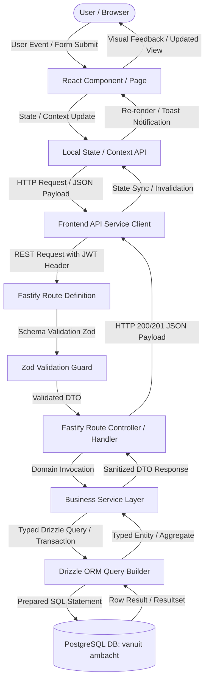

---

# 2. Authentication Data Flow

The transition between the current prototype session model and the planned Fastify JWT authentication pipeline:

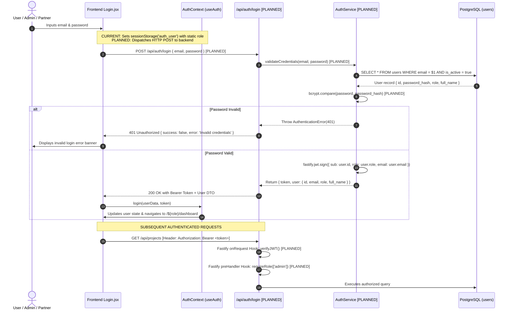

---

# 3. Lead Data Flow (8-Step Intake Pipeline)

In `WorkflowTracker.jsx`, each lead undergoes an 8-step progression. The table below details how frontend lead intake maps to the database:

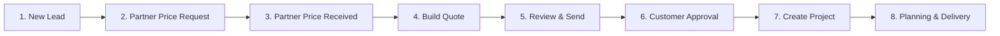

### Detailed Field-to-Database Mapping:
| Frontend UI Source (`WorkflowTracker.jsx` / `Leads.jsx`) | Current Storage | Planned API Endpoint | Database Target (`leads` / related) |
| :--- | :--- | :--- | :--- |
| `lead.name` | `app_leads_v2` | `POST /api/leads` | `leads.name` (`VARCHAR(150)`) |
| `lead.email` | `app_leads_v2` | `POST /api/leads` | `leads.email` (`VARCHAR(255)`) |
| `lead.phone` | `app_leads_v2` | `POST /api/leads` | `leads.phone` (`VARCHAR(50)`) |
| `lead.address` / `lead.city` | `app_leads_v2` | `POST /api/leads` | `leads.address`, `leads.city` |
| `lead.productType` | `app_leads_v2` | `POST /api/leads` | `leads.product_type` (`ENUM`) |
| `lead.size` | `app_leads_v2` | `POST /api/leads` | `leads.dimensions_inquiry` |
| `lead.workflowStep` (1..8) | `app_leads_v2` | `PATCH /api/leads/:id/step` | `leads.workflow_step` (`SMALLINT`) |
| `lead.assignedTo` ('Tim'/'Bram') | `app_leads_v2` | `POST /api/leads` | `leads.assigned_to_user_id` (`UUID -> users.id`) |
| Plaud Audio Sync (`.mp3`) | `app_plaud_audio_{id}` | `POST /api/leads/:id/voice-notes` | `lead_voice_notes.file_url`, `duration_seconds` |
| Plaud AI Transcript & Summary | `app_plaud_audio_{id}` | `POST /api/leads/:id/voice-notes` | `lead_voice_notes.transcript_text`, `ai_summary` |
| Commercial Note + Task form | `app_commercial_actions_{id}` | `POST /api/leads/:id/actions` | `commercial_actions` table (`lead_id`, `note`) |
| Auto-generated task for Tim/Bram | `app_tasks_v2` | `POST /api/tasks` | `tasks` table (`assigned_to_user_id`) |

---

# 4. Partner Price Request Flow (7-Step Wizard)

When Admin clicks **"Open 7-Step Partner Price Request Wizard"** in Step 2 of `WorkflowTracker.jsx`, the following payload is constructed and dispatched:

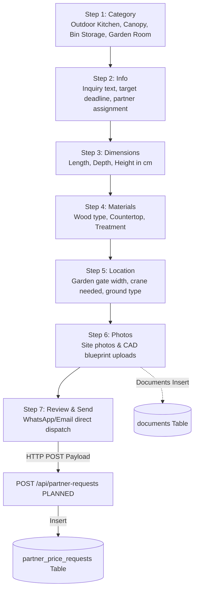

### Wizard Field to Database Mapping:
* **Step 1 (Category):** `wizardForm.category` ➡️ `partner_price_requests.category`
* **Step 2 (Info):** `wizardForm.info`, `wizardForm.deadline` ➡️ `partner_price_requests.product_info`, `expected_response_date`
* **Step 3 (Dimensions):** `{ length: 240, depth: 80, height: 95 }` ➡️ `partner_price_requests.dimensions` (`JSONB`)
* **Step 4 (Materials):** `{ wood: 'Thermo Fraké', top: 'Concrete Cire' }` ➡️ `partner_price_requests.materials` (`JSONB`)
* **Step 5 (Location):** `{ gateWidth: 90, crane: false }` ➡️ `partner_price_requests.location_access` (`JSONB`)
* **Step 6 (Photos):** Files uploaded ➡️ `documents` table (`lead_id` populated, `partner_id` populated, `document_type = 'cad_blueprint'`)
* **Step 7 (Review):** Generates `request_number` (`REQ-2026-001`), sets status to `'requested'`.

---

# 5. Partner Offer Flow

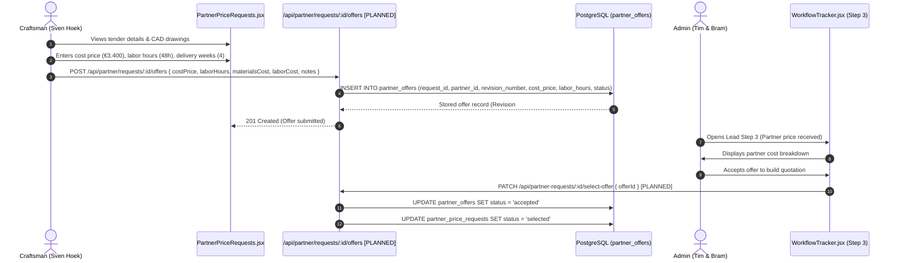

---

# 6. Quote Flow (6-Step Proposal Generator)

In `QuoteEditor.jsx`, proposals are drafted, versioned, and rendered using `Offerte6PagePDF.jsx`.

```mermaid
flowchart TD
    Q_Init[Create Quote Draft] --> Q_Step1[Step 1: Customer Details<br/>Name, email, phone, city, address]
    Q_Step1 --> Q_Step2[Step 2: Cover Page<br/>Titles, 3 curated photo picks, subtitles]
    Q_Step2 --> Q_Step3[Step 3: Configuration<br/>Wood type, lifespan, BBQ cutout, 2D diagram]
    Q_Step3 --> Q_Step4[Step 4: Investment & Terms<br/>Line items, margin, disclaimers, installments]
    Q_Step4 --> Q_Step5[Step 5: Process Letter<br/>5 steps intro, personalized message]
    Q_Step5 --> Q_Step6[Step 6: Review & Publish<br/>Generates public token & 6-page PDF]
    
    Q_Step6 -->|Insert Master| DB_Q[(quotes Table)]
    Q_Step6 -->|Insert Immutable Revision| DB_QV[(quote_versions Table is_current=true)]
    Q_Step6 -->|Insert Line Items| DB_QI[(quote_items Table)]
    
    DB_Q --> Public_Route[/offerte/:token Public Route]
    Public_Route -->|Customer Signs Digitally| Customer_Sign[Digital Signature SVG Captured]
    Customer_Sign -->|Update Status| DB_QV_Approve[UPDATE quote_versions SET status='approved']
```

### Relational Entity Division:
* **`quotes` Table:** High-level proposal record (`quote_number`, `public_token`, `customer_id`, `status: 'sent'`).
* **`quote_versions` Table:** Immutable snapshot (`version_number`, `is_current: true`, covers, wood specs, VAT amounts, installment definitions).
* **`quote_items` Table:** Authoritative positional line items (`position`, `title`, `unit_price_incl_vat`, `vat_rate`, `is_included`, `is_stelpost`).

---

# 7. Project Flow (Active Build Management)

Upon customer quote approval (`status = 'approved'`), the quote seamlessly converts into an active Project (`projects` table).

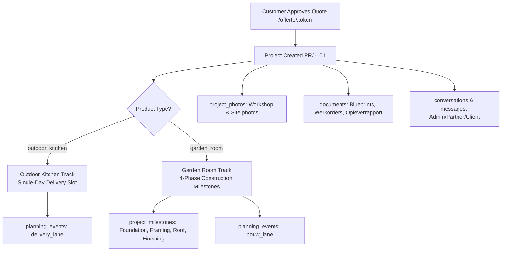

### Product Category Data Routing:
1. **`outdoor_kitchen`:**
   * Handled via `OutdoorKitchenProjects.jsx`.
   * Manages delivery proposal: `projects.delivery_slot` (`proposed_date`, `time_window`, `approved_by_customer`).
   * Generates single-day delivery event in `planning_events(calendar_lane = 'delivery_lane')`.
2. **`garden_room`:**
   * Handled via `GardenRoomProjects.jsx`.
   * Provisions 4 sequential records in `project_milestones` (`milestone_code`: `'foundation'`, `'framing'`, `'roofing'`, `'finishing'`).
   * Generates multi-day span in `planning_events(calendar_lane = 'bouw_lane')`.

---

# 8. Invoice, Payment & Double-Entry Accounting Flow

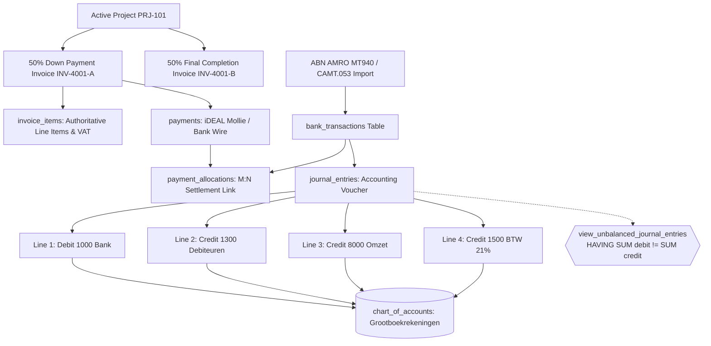

### Double-Entry Rule Enforcement:
* Authoritative line items in `invoice_items` define individual net amounts and tax brackets (21% or 9%).
* Bank statement lines settle invoices via `payment_allocations` (allowing 1 bank payment to settle $N$ invoices, or 1 invoice to be paid across $N$ installments).
* Every `journal_entries` header must balance across `journal_entry_lines`:
  $$\sum \text{Debit} = \sum \text{Credit}$$
* The active view `view_unbalanced_journal_entries` continually audits the database for any ledger anomalies.

---

# 9. Documents Flow (Strong FK Architecture)

The system rejects loose polymorphic relationships. The `documents` table enforces an XOR database CHECK constraint:

$$\text{num\_nonnulls}(\text{project\_id}, \text{quote\_id}, \text{partner\_id}, \text{lead\_id}, \text{invoice\_id}) = 1$$

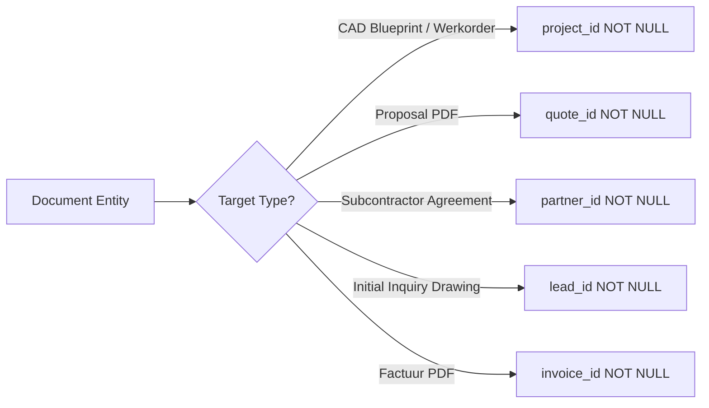

### Document Types Catalog:
* `cad_blueprint`: Architectural dimensional drawings attached to `project_id`.
* `werkorder_pdf`: Craftsman execution sheet (`WO-xxx`) attached to `project_id`.
* `offerte_pdf`: 6-page digital sales proposal attached to `quote_id`.
* `factuur_pdf`: Official Dutch invoice PDF attached to `invoice_id`.
* `opleverrapport_pdf`: Official handover completion sign-off attached to `project_id`.
* `bank_statement`: Raw MT940 / CAMT.053 statement files.

*(Note: Workshop and site progress photos are exclusively stored in `project_photos` to maintain single source of truth).*

---

# 10. Communication Flow

```mermaid
flowchart TD
    Context[Project PRJ-101 / Lead L-1001] --> Conv[conversations Table]
    
    Conv --> Part1[conversation_participants: Admin Tim]
    Conv --> Part2[conversation_participants: Craftsman Sven]
    Conv --> Part3[conversation_participants: Customer Bjorn]
    
    Conv --> Msg1[Message 1: "Framework completed in workshop"]
    Conv --> Msg2[Message 2: "Delivery confirmed for Tuesday"]
    
    Msg1 -.-> Att[attachment_document_id -> documents.id]
```

---

# 11. Frontend Mock/LocalStorage → Backend Migration Mapping

This table documents every actual `localStorage` key found in the codebase and its direct mapping to the relational database:

| Frontend Source File | Current Storage Key | Target API Endpoint [PLANNED] | Backend Database Table(s) |
| :--- | :--- | :--- | :--- |
| `useAuth.jsx` | `sessionStorage('auth_user')` | `POST /api/auth/login` | `users` |
| `WorkflowTracker.jsx`, `Leads.jsx` | `localStorage('app_leads_v2')` | `GET/POST /api/leads` | `leads` |
| `WorkflowTracker.jsx` | `localStorage('app_plaud_audio_{id}')` | `POST /api/leads/:id/voice-notes` | `lead_voice_notes` |
| `WorkflowTracker.jsx` | `localStorage('app_commercial_actions_{id}')` | `POST /api/leads/:id/actions` | `commercial_actions` |
| `Tasks.jsx` | `localStorage('app_tasks_v2')` | `GET/POST /api/tasks` | `tasks` |
| `Leads.jsx` (Step 2 Wizard) | `localStorage('app_partner_requests')` | `POST /api/partner-requests` | `partner_price_requests` |
| `PartnerPriceRequests.jsx` | `localStorage('app_partner_submitted_offers')`| `POST /api/partner/requests/:id/offers`| `partner_offers` |
| `Quotes.jsx`, `QuoteEditor.jsx` | `localStorage('app_quotes_v2')` | `GET/POST /api/quotes` | `quotes`, `quote_versions`, `quote_items` |
| `PublicOfferte.jsx` | `localStorage('app_quotes_v2')` | `GET /api/offerte/:token` | `quotes`, `quote_versions` |
| `Projects.jsx`, `ProjectGlobalInbox.jsx`| `localStorage('app_projects')` | `GET/POST /api/projects` | `projects` |
| `GardenRoomProjects.jsx` | Dynamic in-memory milestones | `GET /api/projects/:id/milestones` | `project_milestones` |
| `PartnerProjects.jsx`, `AdminPhotos.jsx`| `localStorage('app_project_photos')` | `POST /api/projects/:id/photos` | `project_photos` |
| `Planning.jsx`, `PartnerPlanning.jsx`| `localStorage('app_partner_planning')` | `GET/POST /api/planning/events` | `planning_events` |
| `Invoices.jsx` | `localStorage('app_invoices')` | `GET/POST /api/invoices` | `invoices`, `invoice_items` |
| `Invoices.jsx`, `CustomerProject.jsx`| In-memory payments / status update | `POST /api/payments` | `payments`, `payment_allocations` |
| `Bank.jsx`, `abnParser.js` | `localStorage('app_bank_txs')` | `POST /api/bank/import-statement` | `bank_transactions` |
| `journalEngine.js` | `localStorage('app_journal_entries')` | `POST /api/bank/reconcile` | `journal_entries`, `journal_entry_lines` |
| `Customers.jsx`, `customerConversion.js`| `localStorage('app_customers')` | `GET /api/customers` | `customers` |
| `Partners.jsx` | `localStorage('app_partners_v2')` | `GET/POST /api/partners` | `partners` |
| `Documents.jsx` | `localStorage('app_documents')` | `GET/POST /api/documents` | `documents` |
| `ProjectChatInboxPage.jsx` | `localStorage('app_project_messages_{id}')` | `GET/POST /api/conversations/:id/messages`| `conversations`, `messages` |
| `Settings.jsx` | `localStorage('company_info')` | `GET/PATCH /api/settings/company` | `company_info` [PLANNED or Settings key] |
| `Settings.jsx` | `localStorage('app_system_users')` | `GET/POST /api/users` | `users` |

---

# 12. API → Database Mapping

| Feature | Frontend Source | API Endpoint | Backend Service | DB Table(s) | Status |
| :--- | :--- | :--- | :--- | :--- | :--- |
| **Authentication** | `Login.jsx` | `POST /api/auth/login` | `AuthService.login` | `users` | BACKEND PLANNED |
| **Lead Intake** | `Leads.jsx` | `POST /api/leads` | `LeadService.create` | `leads` | BACKEND PLANNED |
| **Lead Voice Notes** | `WorkflowTracker.jsx` | `POST /api/leads/:id/voice-notes` | `LeadService.addVoiceNote` | `lead_voice_notes` | BACKEND PLANNED |
| **Commercial Notes**| `WorkflowTracker.jsx` | `POST /api/leads/:id/actions` | `LeadService.addAction` | `commercial_actions` | BACKEND PLANNED |
| **Partner Inquiry** | `Leads.jsx` (Wizard) | `POST /api/partner-requests` | `PartnerService.createRequest`| `partner_price_requests` | BACKEND PLANNED |
| **Partner Price Bid**| `PartnerPriceRequests.jsx`| `POST /api/partner/requests/:id/offers`| `PartnerService.submitOffer` | `partner_offers` | BACKEND PLANNED |
| **Quote Authoring** | `QuoteEditor.jsx` | `POST /api/quotes/:id/versions` | `QuoteService.createVersion` | `quotes`, `quote_versions`, `quote_items`| BACKEND PLANNED |
| **Public Offerte** | `PublicOfferte.jsx` | `GET /api/offerte/:token` | `QuoteService.getByToken` | `quotes`, `quote_versions`, `quote_items`| BACKEND PLANNED |
| **Proposal Approval**| `PublicOfferte.jsx` | `POST /api/offerte/:token/approve`| `QuoteService.approve` | `quote_versions`, `projects` | BACKEND PLANNED |
| **Project Master** | `Projects.jsx` | `GET /api/projects` | `ProjectService.list` | `projects` | BACKEND PLANNED |
| **Milestones** | `GardenRoomProjects.jsx` | `PATCH /api/projects/:id/milestones/:mId`| `ProjectService.updateMilestone`| `project_milestones` | BACKEND PLANNED |
| **Project Photos** | `PartnerProjects.jsx` | `POST /api/projects/:id/photos` | `MediaService.uploadPhoto` | `project_photos` | BACKEND PLANNED |
| **Planning Events** | `Planning.jsx` | `GET/POST /api/planning/events` | `PlanningService.manage` | `planning_events` | BACKEND PLANNED |
| **Invoicing** | `Invoices.jsx` | `POST /api/invoices` | `InvoiceService.issue` | `invoices`, `invoice_items` | BACKEND PLANNED |
| **Payment Receipt** | `Invoices.jsx` | `POST /api/payments` | `PaymentService.record` | `payments`, `payment_allocations` | BACKEND PLANNED |
| **Bank Parsing** | `Bank.jsx` | `POST /api/bank/import-statement` | `BankService.parseStatement` | `bank_transactions` | BACKEND PLANNED |
| **Journal Vouchers**| `journalEngine.js` | `POST /api/bank/reconcile` | `AccountingService.createEntry`| `journal_entries`, `journal_entry_lines` | BACKEND PLANNED |
| **Document Vault** | `Documents.jsx` | `POST /api/documents` | `DocumentService.upload` | `documents` | BACKEND PLANNED |

*(Status Legend: `EXISTING FRONTEND` = UI fully functional in React prototype; `BACKEND PLANNED` = Route designed and ready for Fastify controller implementation).*

---

# 13. Complete End-to-End Data Flow (Mermaid Visualizations)

### Flow 1: Lead → Quote → Project
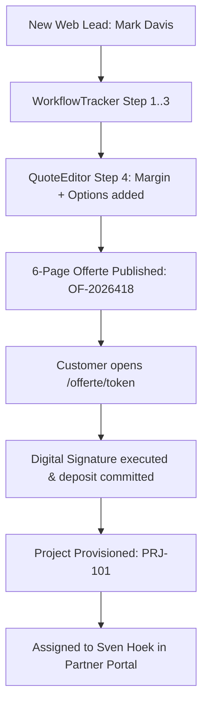

### Flow 2: Lead → Partner Tender → Partner Offer → Quote
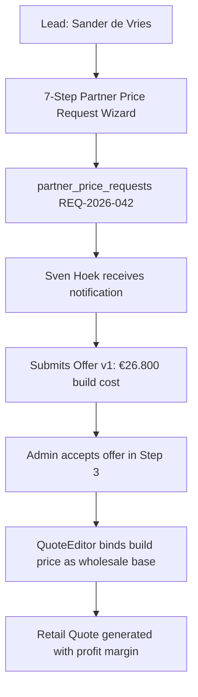

### Flow 3: Quote → Customer Approval → Project Delivery
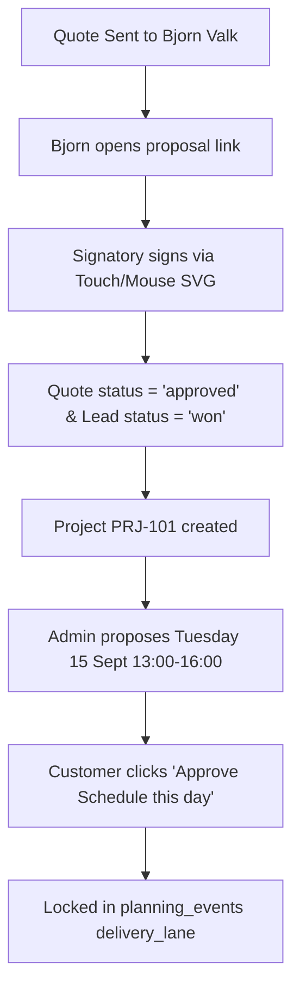

### Flow 4: Project → Invoice → Payment → Accounting
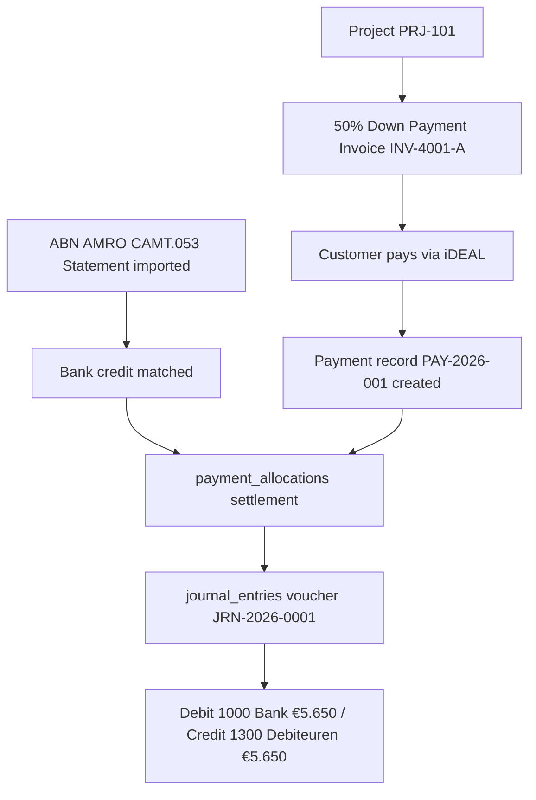

### Flow 5: Project → Documents / Photos / Communication
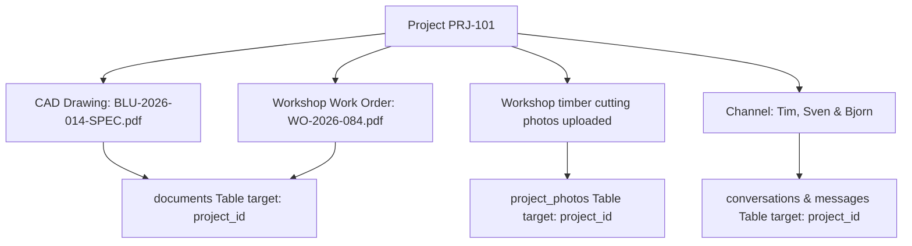

---

# 14. Data Ownership (Authoritative Source of Truth)

To prevent data drift and conflicting state, authoritative ownership is assigned as follows:

| Business Domain | Authoritative Database Table | Prohibited Redundancies / Derived Anti-Patterns |
| :--- | :--- | :--- |
| **Authentication & Roles** | `users` | Role cannot be stored as a loose string in session or customer records. |
| **Customer Master** | `customers` | Total lifetime spend and active project count are NEVER stored columns; computed via SQL. |
| **Craftsmen Master** | `partners` | Workload status and ratings reside exclusively here. |
| **Sales Inquiries** | `leads` | Plaud audio files and commercial consultation notes are NOT stored as JSON arrays in `leads`. |
| **Audio Consultations** | `lead_voice_notes` | Sole authoritative storage for audio files, durations, and AI transcripts. |
| **Sales Follow-ups** | `commercial_actions` | Must link to either a lead OR a project (never orphaned). |
| **Action Items** | `tasks` | Assigned strictly to `users.id` foreign keys (no hardcoded `'Tim'` / `'Bram'`). |
| **Subcontractor Bids** | `partner_offers` | Holds revision numbers and cost breakdowns. |
| **Quotations** | `quotes` + `quote_versions` + `quote_items` | Master proposal metadata resides in `quotes`; immutable snapshots in `quote_versions`; lines in `quote_items`. |
| **Active Jobs** | `projects` | Master state for delivery address, agreed build cost, and retail contract value. |
| **Construction Milestones** | `project_milestones` | Sole tracker for sequential phases (Foundation, Framing, Roofing, Finishing). |
| **Site & Workshop Photos**| `project_photos` | Sole source of truth for photos. Photos are NOT duplicated in `documents`. |
| **Schedule & Deadlines** | `planning_events` | Unified calendar engine serving Admin Delivery, Partner Bouw, and Workshop lanes. |
| **Billing & Facturatie** | `invoices` + `invoice_items` | Tax rates are authoritative at the item level (`invoice_items.vat_rate`). |
| **Settlement Clearing** | `payment_allocations` | Authoritative M:N bridge reconciling payments with bank lines. |
| **Financial Ledger** | `journal_entries` + `journal_entry_lines` | Balanced double-entry accounting records. |
| **Technical Documents** | `documents` | Stores CAD blueprints, work orders, signed proposals, and handover reports. |

---

# 15. Data Flow Rules & Critical Constraints

1. **Documents Exactly-One Target Constraint:**
   Every document record must link to exactly one parent entity. The database enforces:
   $$\text{num\_nonnulls}(\text{project\_id}, \text{quote\_id}, \text{partner\_id}, \text{lead\_id}, \text{invoice\_id}) = 1$$
2. **Commercial Actions Mutually Exclusive Target:**
   A commercial action note must link to either a `lead_id` or a `project_id`, never both and never neither:
   $$(\text{lead\_id IS NOT NULL AND project\_id IS NULL}) \lor (\text{lead\_id IS NULL AND project\_id IS NOT NULL})$$
3. **Lead Step Bounding Rule:**
   `workflow_step` is strictly constrained: $1 \le \text{workflow\_step} \le 8$.
4. **Project Progress Bounding Rule:**
   `progress_percentage` is strictly constrained: $0 \le \text{progress\_percentage} \le 100$.
5. **Positive Payment Settlement:**
   Every allocation in `payment_allocations` must satisfy $\text{allocated\_amount} > 0$.
6. **Non-Negative Accounting Ledger:**
   In `journal_entry_lines`, debit and credit must be $\ge 0$, and at least one must be $> 0$.
7. **Single Current Version Partial Index:**
   A quote may have multiple historical revisions, but exactly one current active version is guaranteed via:
   `CREATE UNIQUE INDEX idx_current_quote_version ON quote_versions(quote_id) WHERE is_current = true;`

---

# 16. Unknowns / TODO / Needs Confirmation

The following operational integrations and external contracts cannot be determined from the static frontend code alone and require explicit confirmation prior to implementation:

1. **`NEEDS CONFIRMATION` — WhatsApp Business Provider:**
   * Does Vanuit Ambacht utilize the direct **Meta WhatsApp Cloud API** (Graph API with phone number ID) or a third-party aggregator like **Twilio** / **MessageBird**?
2. **`NEEDS CONFIRMATION` — Payment Gateway Merchant:**
   * Is online deposit collection processed via **Mollie** (standard for Dutch iDEAL) or **Stripe**?
3. **`NEEDS CONFIRMATION` — Live Bank Integration vs File Import:**
   * Is ABN AMRO reconciliation handled purely through manual statement upload (MT940 / CAMT.053 files as currently simulated in `abnParser.js`), or is a live PSD2 open banking API (e.g., Yapily / Tink / Nordigen) planned?
4. **`NEEDS CONFIRMATION` — Bol.com Seller API Integration:**
   * Is Bol.com settlement currently ingested via CSV/PDF export or via direct Bol.com Retailer API v10 credentials?
5. **`NEEDS CONFIRMATION` — Production File Storage:**
   * Will production CAD blueprints and workshop photos be hosted on an **AWS S3 bucket**, **Cloudinary**, or an on-premise persistent disk volume?
